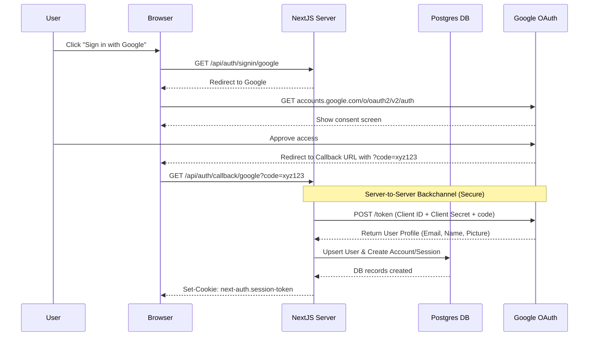

# Phase 2: Authentication with NextAuth (Auth.js) - A Deep Dive

Welcome to Phase 2 of the SideQuestHQ backend integration. As a frontend developer, you might be used to calling an API and getting an auth token back, storing it in `localStorage`, and sending it with every request. But when you build your own backend—especially in a framework like Next.js that runs on both the server and the client—authentication works differently. We use **sessions**, usually stored in secure, HTTP-only cookies.

In this phase, we'll implement full authentication using NextAuth (now known as Auth.js). We are using NextAuth v5 (the latest beta) along with the Prisma adapter. We'll connect it to the Google OAuth provider, integrate it with the existing Postgres database we set up in Phase 1, and wire it up to your existing frontend auth screen.

---

## 1. Authentication vs Authorization — The Most Important Distinction

Before we look at code, let's clear up the two most confusing terms in security: **Authentication** and **Authorization**.

*   **Authentication (AuthN):** WHO are you? This is the login process. When a user provides a username and password, or signs in with Google, they are authenticating. They are proving their identity to the system.
*   **Authorization (AuthZ):** WHAT are you allowed to do? Once we know who you are, authorization determines your permissions. Can you delete this post? Only if you are the author or an admin. Can you view this billing page? Only if you are an owner of the organization.

Your app needs both, but they happen at different times and in different places.

*   **Authentication** happens at the front door (e.g., the `/auth` page). Once a user successfully authenticates, the server gives them a "badge."
*   **Authorization** happens at every internal door (e.g., inside an API route or a protected page). The server checks the badge before letting the user through.

### The Session: Your Digital Badge

In a web application, HTTP is stateless. The server doesn't remember you from one request to the next. So, how does it know you logged in 5 minutes ago?

The answer is a **session**. When you authenticate successfully, the server creates a record (either in its memory, in a database, or as an encrypted token). It then sends a tiny piece of data back to your browser—a **cookie**—that acts as your badge.

Every time your browser makes a subsequent request to the server, it automatically includes that cookie. The server reads the cookie, looks up the session, and says, "Ah, I know who you are." This is the core mechanism of web authentication.

---

## 2. The Auth Flow — What Actually Happens

Let's break down exactly what happens when a user clicks the "Sign in with Google" button on your frontend. We are using **OAuth 2.0**, an industry-standard protocol for authorization.

Here is the step-by-step flow:

1.  **User Initiation:** The user clicks "Sign in with Google" on your site.
2.  **Redirect to Provider:** Your app redirects the user's browser to Google's special OAuth page. This URL includes your app's unique "Client ID."
3.  **User Consent:** Google shows a screen saying, "SideQuestHQ wants to access your name and email." The user clicks "Allow."
4.  **Redirect with Code:** Google redirects the user's browser *back* to your app (to a specific "Callback URL" you configured), appending a temporary, single-use "authorization code" to the URL.
5.  **Token Exchange (Server-to-Server):** This is the crucial security step. Your Next.js server takes that code and makes a direct, secure HTTP request to Google's servers. It says, "Here is the code the user gave me, and here is my super-secret Client Secret. Please give me an access token."
6.  **Provider Response:** Google verifies the secret and returns an access token, plus the user's profile info (name, email, profile picture).
7.  **Database Sync:** Your server checks your Postgres database. Does a user with this email exist? If not, it creates a new `User` record. It also creates an `Account` record (linking the user to Google) and a `Session` record.
8.  **Session Cookie:** Finally, your server sends an HTTP response back to the browser, setting an HTTP-only, secure cookie containing a session token.
9.  **Subsequent Requests:** For all future requests, the browser sends that cookie. Your server validates it and knows the user is logged in.

Here's how that looks as a sequence diagram:



---

## 3. Why NextAuth (Auth.js) and Not Building from Scratch?

As a frontend developer, you might be tempted to build the auth flow yourself. After all, it's just HTTP requests and a database, right?

**Do not build authentication from scratch.**

Authentication is deceptively complex and highly prone to catastrophic security vulnerabilities. If you build it yourself, you have to manually handle:

*   **OAuth 2.0 / OIDC protocols:** Constructing the exact URLs, handling state parameters to prevent CSRF attacks, parsing tokens.
*   **Session Management:** Generating cryptographically secure session IDs, handling expiration, storing them securely in cookies, managing token rotation.
*   **Database Schema:** Designing tables that can handle a single user logging in with multiple providers (Google *and* GitHub) without creating duplicate accounts.
*   **Security Vulnerabilities:** Preventing Cross-Site Request Forgery (CSRF), Cross-Site Scripting (XSS), timing attacks, and session hijacking.

**NextAuth (Auth.js)** handles all of this for you. It provides a set of pre-built functions and API routes that completely abstract away the complexity. With ~20 lines of configuration, you get production-ready, secure authentication.

Why NextAuth instead of hosted solutions like Clerk, Supabase Auth, or Auth0?
*   **Data Ownership:** NextAuth stores all user data in *your* Postgres database (which we set up in Phase 1). You own the data. Hosted solutions often lock your user data in their databases.
*   **Cost:** NextAuth is free and open-source. Hosted solutions charge based on active users.
*   **Integration:** Since we are already using Next.js and Prisma, NextAuth integrates perfectly with our stack via the `@auth/prisma-adapter`.

---

## 4. The Prisma Adapter — What it Does

NextAuth doesn't care what database you use, or even if you use one at all (it can store sessions purely in encrypted cookies). However, for a serious application like SideQuestHQ, we want to store users and sessions in our Postgres database.

To bridge NextAuth and our Prisma schema, we use an adapter: `@auth/prisma-adapter`.

An adapter is just a set of functions that tells NextAuth how to talk to your specific database. When a user logs in, NextAuth tells the adapter, "Hey, save this user." The Prisma adapter translates that into `prisma.user.upsert(...)`.

### Schema Requirements

For the Prisma adapter to work, our database schema needs specific models. These were already included in the Phase 1 schema: `User`, `Account`, `Session`, and `VerificationToken`. **Review Phase 1 schema.prisma to confirm all four models exist.**

*Don't forget to run `npx prisma db push` after updating your schema!*

---

## 5. NextAuth Config File — Full Walkthrough

In NextAuth v5 (Auth.js), we configure everything in a single, central file at the root of the project.

Create a new file: `src/auth.ts`

```typescript
// src/auth.ts
import NextAuth from "next-auth"
import { PrismaAdapter } from "@auth/prisma-adapter"
import prisma from "@/server/infrastructure/db/postgres/client"
import GoogleProvider from "next-auth/providers/google"

// We export these functions to use them in our app.
// 'handlers' will be used in our API route.
// 'auth' is used to get the session on the server.
// 'signIn' and 'signOut' are used in Server Actions or API routes.
export const { handlers, auth, signIn, signOut } = NextAuth({
  // 1. Connect NextAuth to our Prisma database
  adapter: PrismaAdapter(prisma),

  // 2. Define the authentication strategy
  session: {
    // 'database' means we store sessions in the Session table we created.
    // The alternative is 'jwt', which stores all user data directly in the cookie.
    // For SideQuestHQ, 'database' is better because we can easily revoke sessions
    // by deleting the row from the database.
    strategy: "database",
  },

  // 3. Configure the providers (the services users can log in with)
  providers: [
    GoogleProvider({
      clientId: process.env.GOOGLE_CLIENT_ID!,
      clientSecret: process.env.GOOGLE_CLIENT_SECRET!,
      authorization: {
        params: {
          prompt: "consent",
          access_type: "offline",
          response_type: "code"
        }
      }
    }),
  ],

  // 4. Configure custom pages
  pages: {
    // Tell NextAuth to use our custom UI instead of its default, ugly login page.
    signIn: '/auth',
  },

  // 5. Callbacks: The most powerful part of NextAuth
  callbacks: {
    // The session callback runs every time we call `auth()` or `useSession()`.
    // By default, NextAuth only returns the user's name, email, and image for security.
    // We MUST attach the user's database ID to the session so our backend knows WHO is making the request.
    async session({ session, user }) {
      if (session.user && user) {
        // We extend the session object to include the database ID
        session.user.id = user.id;
      }
      return session;
    },
  },
})
```

**Key Takeaways:**
*   **The Strategy:** We use `strategy: "database"`. This means the cookie on the frontend just holds a random string (the session token). The server takes that string, looks it up in the Postgres `Session` table, and finds the corresponding `User`. This is highly secure and allows you to kick users out by deleting their session row.
*   **The Callback:** The `session` callback is crucial. Without it, when you check who is logged in, you'll only get `{ name: "Agrim", email: "agrim@example.com" }`. You won't know their database ID, which makes it impossible to query the database for their specific data (like "Get posts authored by user ID 123").

---

## 6. The Route Handler

NextAuth provides all the endpoints needed for the auth flow (`/api/auth/signin`, `/api/auth/callback/google`, etc.). Instead of writing these manually, NextAuth uses a "catch-all" route handler in Next.js.

Create this file exactly at this path: `src/app/api/auth/[...nextauth]/route.ts`.

```typescript
// src/app/api/auth/[...nextauth]/route.ts
import { handlers } from "@/auth" // Path to the auth.ts file we just created

// We import the handlers from our config and export them as GET and POST.
// This tells Next.js: "If any request comes to /api/auth/*, let NextAuth handle it."
export const { GET, POST } = handlers
```

That's it. It's just two lines of code. The magic happens behind the scenes. The `[...nextauth]` folder name is a special Next.js feature called a "catch-all segment". It means this route will intercept `/api/auth/a`, `/api/auth/a/b/c`, and everything in between.

---

## 7. `getUser.ts` and `requireUser.ts` — The Auth Guards

You have empty stubs in `src/server/infrastructure/auth/` for `getUser.ts` and `requireUser.ts`. Let's fill them in. These are your "Authorization Guards." You will use these functions in every single backend endpoint you build.

### `getUser.ts`

This function is for **optional** authentication. It checks if a user is logged in. If they are, it returns the user object. If not, it returns `null`. You use this when a page can be viewed by both guests and logged-in users.

```typescript
// src/server/infrastructure/auth/getUser.ts
import { auth } from "@/auth";

export async function getUser() {
  try {
    // auth() reads the cookies from the incoming request and validates the session
    const session = await auth();

    // If there is no session, or the session doesn't have a user, return null
    if (!session || !session.user) {
      return null;
    }

    // Return the user object (which includes the ID because of our callback in auth.ts)
    return session.user;
  } catch (error) {
    // If something goes wrong parsing the cookie, fail gracefully
    console.error("Failed to get user session:", error);
    return null;
  }
}
```

### `requireUser.ts`

This function is for **strict** authorization. It is used in protected API routes (e.g., creating a post, updating a profile). If the user is not logged in, it completely stops execution by throwing an error.

```typescript
// src/server/infrastructure/auth/requireUser.ts
import { getUser } from "./getUser";

export async function requireUser() {
  const user = await getUser();

  if (!user) {
    // Why throw a Response object instead of a generic Error?
    // In Next.js App Router API Routes (Route Handlers), if you throw a Response,
    // Next.js will catch it and immediately return that response to the client.
    // This is a very clean way to short-circuit the request without complex if/else blocks.
    throw new Response(
      JSON.stringify({ error: "Unauthorized. You must be logged in to perform this action." }),
      {
        status: 401,
        headers: { 'Content-Type': 'application/json' }
      }
    );
  }

  return user;
}
```

**Usage Pattern:**

Now, in any protected API route you write, your code will look incredibly clean:

```typescript
// Example: src/app/api/cohorts/route.ts
import { requireUser } from "@/server/infrastructure/auth/requireUser";

export async function POST(request: Request) {
  // 1. Verify AuthZ: This will throw a 401 and stop execution if not logged in.
  const user = await requireUser();

  // 2. We know for a fact the user is logged in here.
  const data = await request.json();

  // 3. Create the cohort, associating it with the authenticated user's ID
  const newCohort = await prisma.cohort.create({
    data: {
      title: data.title,
      creatorId: user.id // We have access to the ID safely!
    }
  });

  return Response.json(newCohort);
}
```

---

## 8. Setting up Google OAuth Credentials

You cannot test this until you tell Google about your app.

1.  Go to the [Google Cloud Console](https://console.cloud.google.com/).
2.  Create a new Project (e.g., "SideQuestHQ-Dev").
3.  Go to "APIs & Services" -> "OAuth consent screen". Choose "External". Fill in the required fields (App name, support email). You don't need to verify it for development.
4.  Go to "Credentials" -> "Create Credentials" -> "OAuth client ID".
5.  Application type: "Web application".
6.  Name: "NextJS App".
7.  **Authorized JavaScript origins:** Add `http://localhost:3000` (for dev) and your production URL later (e.g., `https://sidequesthq.in`).
8.  **Authorized redirect URIs:** This is the most critical step. Google will ONLY send the user back to these exact URLs.
    *   Add: `http://localhost:3000/api/auth/callback/google`
    *   Add: `https://sidequesthq.in/api/auth/callback/google` (for prod)
9.  Click Create. You will get a **Client ID** and **Client Secret**.

### Environment Variables

Add these to your `.env.local` file (never commit this file to git!):

```env
# Your database URLs from Phase 1
DATABASE_URL="postgresql://..."
DIRECT_URL="postgresql://..."

# MongoDB from Phase 0
MONGODB_URI="mongodb+srv://..."

# The Google Credentials you just created
GOOGLE_CLIENT_ID="your-client-id.apps.googleusercontent.com"
GOOGLE_CLIENT_SECRET="your-client-secret"

# NextAuth Configuration
# The canonical URL of your app
NEXTAUTH_URL="http://localhost:3000"

# A random secret used to hash tokens, sign cookies, and generate cryptographic keys.
# Run this in your terminal to generate one: openssl rand -base64 32
AUTH_SECRET="v+U4w...random...string...="
```

*(Note: In NextAuth v5, `AUTH_SECRET` is used instead of the older `NEXTAUTH_SECRET`)*

---

## 9. Using Auth in Server Components and API Routes

Next.js has Server Components (which run once on the server) and Client Components (which run in the browser). You handle auth differently in both.

### In a Server Component (or Server Action)
You don't need an API call. You can read the cookie directly using the `auth()` function we exported from `auth.ts`.

```tsx
// src/app/dashboard/page.tsx (Server Component)
import { auth } from "@/auth";
import { redirect } from "next/navigation";

export default async function DashboardPage() {
  const session = await auth();

  // Protect the page: if no session, redirect to the custom auth screen
  if (!session) {
    redirect("/auth");
  }

  return (
    <div>
      <h1>Welcome back, {session.user.name}</h1>
      <p>Your User ID is: {session.user.id}</p>
    </div>
  );
}
```

### In a Client Component

You CANNOT call `auth()` in a client component, because `auth()` uses Node.js modules to decrypt cookies, which don't exist in the browser.

Instead, NextAuth provides a React Hook: `useSession()`.

First, you must wrap your app in a `SessionProvider`. Do this in your root layout:

```tsx
// src/app/layout.tsx
import { SessionProvider } from "next-auth/react";

export default function RootLayout({ children }: { children: React.ReactNode }) {
  return (
    <html lang="en">
      <body>
        {/* Wrap your application in the SessionProvider */}
        <SessionProvider>
          {children}
        </SessionProvider>
      </body>
    </html>
  );
}
```

Now, in any client component, you can use the hook:

```tsx
'use client'; // This is a Client Component
import { useSession } from "next-auth/react";

export function UserProfileWidget() {
  // useSession handles fetching the session state from the server automatically
  const { data: session, status } = useSession();

  if (status === "loading") return <p>Loading...</p>;
  if (status === "unauthenticated") return <p>Please log in.</p>;

  return ;
}
```

---

## 10. Connecting Your Existing Auth UI

You have an existing screen at `src/client/screens/auth/` with a Google button. Let's wire it up to NextAuth.

Because the button is meant to be clicked by a user, this is a Client Component. We will import `signIn` from `next-auth/react`.

```tsx
// src/client/screens/auth/AuthScreen.tsx
'use client'; // Required because we are attaching onClick handlers

import { signIn } from "next-auth/react";
import { useState } from "react";

export function AuthScreen() {
  const [isLoading, setIsLoading] = useState(false);

  const handleGoogleLogin = async () => {
    setIsLoading(true);
    try {
      // Calling signIn('google') tells NextAuth to start the OAuth flow.
      // The browser will redirect to Google.
      // 'callbackUrl' tells NextAuth where to redirect the user AFTER a successful login.
      await signIn("google", { callbackUrl: "/dashboard" });
    } catch (error) {
      console.error("Login failed:", error);
      setIsLoading(false); // Reset state if it fails immediately
    }
  };

  return (
    <div className="flex flex-col items-center justify-center min-h-screen">
      <h1>Welcome to SideQuestHQ</h1>
      <p>Log in to continue</p>
      
      <button 
        onClick={handleGoogleLogin}
        disabled={isLoading}
        className="mt-4 px-4 py-2 bg-blue-500 text-white rounded flex items-center gap-2"
      >
        {isLoading ? "Redirecting..." : "Sign in with Google"}
      </button>
    </div>
  );
}
```

When the user clicks the button, `signIn('google')` triggers a GET request to `/api/auth/signin/google` (which is caught by our route handler), and the entire flow we described in Section 2 kicks off.

---

## 11. Common Errors in Phase 2

As a frontend dev stepping into backend auth, you will likely hit at least one of these errors. Here is how to fix them:

1.  **Error: `Configuration` page shows up instead of Google.**
    *   **Cause:** You are missing environment variables, usually `AUTH_SECRET` or the Google Client IDs.
    *   **Fix:** Ensure your `.env.local` file is in the root directory, correctly formatted, and your server is restarted.

2.  **Error: `redirect_uri_mismatch` from Google.**
    *   **Cause:** The URL your app told Google to send the user back to does not exactly match the "Authorized redirect URIs" list in the Google Cloud Console.
    *   **Fix:** Check the URL in your browser bar when the error happens. Ensure it is *exactly* `http://localhost:3000/api/auth/callback/google` in the Google Console (no trailing slash, matching http/https).

3.  **Error: `useSession` returns `null` or errors out on the client.**
    *   **Cause:** You forgot to wrap your React tree in `<SessionProvider>`.
    *   **Fix:** Add `<SessionProvider>` to `src/app/layout.tsx` as shown in Section 9.

4.  **Error: User logs in, but no record is created in the database.**
    *   **Cause:** The Prisma Adapter isn't working, usually because your database schema doesn't perfectly match what NextAuth expects.
    *   **Fix:** Ensure your `User`, `Account`, `Session`, and `VerificationToken` models perfectly match the schema provided in Phase 1. Run `npx prisma db push` to sync the database, and restart your server.

5.  **Error: `@auth/prisma-adapter` types are incompatible.**
    *   **Cause:** You are mixing NextAuth v4 (stable) and Auth.js v5 (beta) packages.
    *   **Fix:** Ensure your `package.json` has `"next-auth": "5.0.0-beta.x"` (or newer beta) and `"@auth/prisma-adapter": "^x.x.x"`. Do NOT use the old `@next-auth/prisma-adapter` package, it is deprecated for v5.
