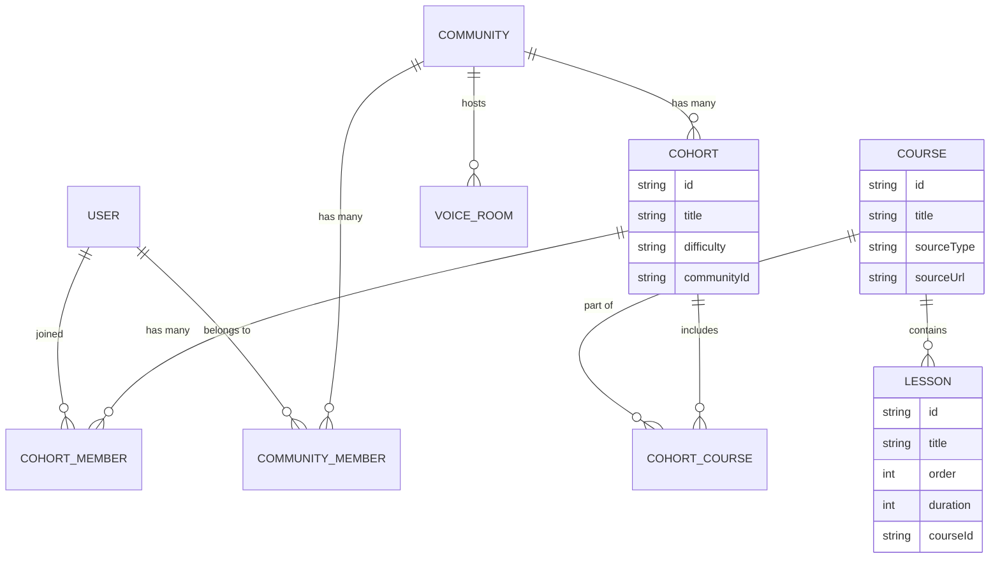

# Phase 3: Courses, Lessons, Cohorts, and Communities in Postgres

Welcome to Phase 3 of the SideQuestHQ backend integration! Up until now, we've set up Next.js 16, TypeScript, and Prisma. We've built some initial auth or basic data models, and you already have a fantastic, well-structured client-side model for `Cohort` located in `src/client/screens/cohort/models/cohort.ts`.

In this phase, we are moving from *mock data and client models* to **real relational data in PostgreSQL**. We will be modeling Courses, Lessons, Cohorts, Communities, and Voice Rooms.

As a frontend expert, you are used to thinking in components, props, and state. In the backend, you need to shift your mental model to **entities, relationships, and queries**.

---

## 1. Relational Thinking — The Most Important Backend Skill

In frontend development (React/Next.js), you think in terms of **components and props**. A `<CohortCard />` takes `title` and `difficulty` as props. It doesn't care where that data came from.

In backend development with relational databases (Postgres via Prisma), you think in terms of **entities and relationships**. Entities are your tables (e.g., `User`, `Cohort`, `Course`). Relationships define how they connect.

### Three Types of Relationships

1. **One-to-One (1:1)**
   - Example: A `User` has exactly one `PublicProfile`. A `PublicProfile` belongs to exactly one `User`.
   - In Prisma: `profile PublicProfile?` on the User model.

2. **One-to-Many (1:N)**
   - Example: A `Course` has many `Lesson`s. Every `Lesson` belongs to exactly one `Course`.
   - In Prisma: `lessons Lesson[]` on Course, and `course Course` on Lesson.

3. **Many-to-Many (M:N)**
   - Example: A `Cohort` can contain multiple `Course`s. A `Course` can be part of multiple `Cohort`s.
   - **Crucial Concept**: Relational databases *cannot* directly store a list of IDs inside a column efficiently. To solve Many-to-Many, we use a **JOIN TABLE** (e.g., `CohortCourse`). This table has two columns: `cohortId` and `courseId`. Each row represents one link.

### The SideQuestHQ Phase 3 ER Diagram

Here is a visual map of how our entities relate:



---

## 2. The Course Model — Design Decisions

A `Course` in SideQuestHQ is a modular learning unit. It might be created natively on our platform, or it might be curated from YouTube, Coursera, or Udemy.

```prisma
model Course {
  id          String   @id @default(cuid())
  title       String
  description String?
  
  // Sourcing metadata
  sourceUrl   String?
  sourceType  SourceType @default(NATIVE) // ENUM: NATIVE, YOUTUBE, COURSERA
  
  // Flexible categorization
  tags        String[] // Array of strings (Postgres supports this!)
  
  // State
  isPublished Boolean  @default(false)
  difficulty  Difficulty @default(BEGINNER) // ENUM
  
  // Relationships
  lessons       Lesson[]
  cohortCourses CohortCourse[]
  
  createdAt   DateTime @default(now())
  updatedAt   DateTime @updatedAt
}

enum SourceType {
  NATIVE
  YOUTUBE
  COURSERA
  UDEMY
}

enum Difficulty {
  BEGINNER
  INTERMEDIATE
  ADVANCED
}
```

### Why `sourceUrl` and `sourceType`?
Since we want to embed or link to external content seamlessly, we need to know where it came from. The frontend can use `sourceType` to decide whether to render a native video player, a YouTube iframe, or an external link out.

### Why `tags: String[]` and not a separate `Tag` table?
In Prisma with PostgreSQL, you can use scalar arrays like `String[]`. For simple tags where you just want to label things ("javascript", "backend"), a string array is perfectly fine.
*When to normalize (create a Tag table)?* If tags need descriptions, cover images, or you need complex analytics (e.g., "how many users clicked the 'javascript' tag"), then you'd want a separate table.

### `isPublished` flag
Every content model needs a draft vs. published state. The frontend should never show a course where `isPublished: false` to regular users.

### `difficulty` as an enum
We use an Enum instead of a plain string. This gives us **type safety** at the database level. You can't accidentally save `difficulty: "HARD"`. It must be `BEGINNER`, `INTERMEDIATE`, or `ADVANCED`.

---

## 3. The Lesson Model — Design Decisions

A `Lesson` is the individual learning item within a `Course`.

```prisma
model Lesson {
  id          String     @id @default(cuid())
  title       String
  description String?
  
  // Ordering and Metadata
  order       Int
  duration    Int        // Stored in seconds
  lessonType  LessonType @default(VIDEO)
  
  // Foreign Key to Course
  courseId    String
  course      Course     @relation(fields: [courseId], references: [id], onDelete: Cascade)
  
  createdAt   DateTime   @default(now())
  updatedAt   DateTime   @updatedAt
}

enum LessonType {
  VIDEO
  ARTICLE
  QUIZ
  ASSIGNMENT
  LIVE
}
```

### `order: Int`
Why store ordering in the database instead of computing it? Because the database is the source of truth. When the creator drags and drops lessons to reorder them, we update the `order` integer for each affected lesson in the database. When querying, we just do `orderBy: { order: 'asc' }`.

### `duration: Int` (in seconds)
Always store time durations as integers (seconds or milliseconds). Do not store formatted strings like `"1h 30m"`. Why?
1. You can sum them up to get the total course duration easily in SQL.
2. The frontend can decide how to format `5400` seconds based on locale or preference.

### `lessonType` Enum
Different lessons need different UIs. An ARTICLE needs a markdown renderer. A VIDEO needs a player. The frontend will switch on this `lessonType` to render the correct component.

### `courseId` and `onDelete: Cascade`
The `courseId` tells Postgres exactly which course this lesson belongs to.
`onDelete: Cascade` is a lifesaver. It means: "If the Course gets deleted, automatically delete all Lessons inside it." Without this, you'd be left with "orphaned" lessons pointing to a course that no longer exists, which causes SQL errors.

---

## 4. The Cohort Model — Mapping Your Existing Types

Your frontend model in `src/client/screens/cohort/models/cohort.ts` has a mix of data. When moving to the backend, you must separate **Relational Data** from **Flexible/User State Data**.

1. **Relational Data (Goes in Postgres Cohort table)**:
   - `id`, `coverImage`, `title`, `subtitle`, `description`, `difficulty`.
   - `creator` (this will be a relation to a `User` table).
   - `stats` (things like `rating` might be stored as a cached float column on the Cohort).

2. **User State Data (Computed or stored elsewhere)**:
   - `progress`: The `journeyProgress` is NOT a property of the Cohort itself. It's a property of the *User's journey through the Cohort*.
   - In a robust backend, `progress` is computed by counting how many `Lesson`s a `User` has marked as completed, divided by total lessons.

Here is the Prisma Cohort model:

```prisma
model Cohort {
  id          String   @id @default(cuid())
  coverImage  String?
  title       String
  subtitle    String?
  description String?
  difficulty  Difficulty @default(BEGINNER)
  
  // Relations
  communityId String?
  community   Community? @relation(fields: [communityId], references: [id])
  
  creatorId   String
  creator     User      @relation("CohortCreator", fields: [creatorId], references: [id])
  
  // Join Tables
  courses     CohortCourse[]
  members     CohortMember[]
  
  createdAt   DateTime @default(now())
  updatedAt   DateTime @updatedAt
}
```

---

## 5. Many-to-Many: CohortCourse Join Table

Why not just put `courseIds: String[]` on the `Cohort`?
While Postgres supports arrays, querying *through* arrays to get relational data is slow and messy. If you want to load a Cohort, its Courses, and all those courses' Lessons, a JOIN TABLE is the relational way to do it.

Plus, we want courses to be ordered *within* a cohort. The same course might be 1st in Cohort A, but 3rd in Cohort B!

```prisma
model CohortCourse {
  cohortId String
  courseId String
  
  order    Int // Order of the course within this specific cohort
  
  cohort   Cohort @relation(fields: [cohortId], references: [id], onDelete: Cascade)
  course   Course @relation(fields: [courseId], references: [id], onDelete: Cascade)

  // Composite Primary Key - A cohort can only have a specific course once
  @@id([cohortId, courseId])
  
  @@index([cohortId])
  @@index([courseId])
}
```

### Querying through the Join Table

To fetch a cohort with its ordered courses in Prisma:

```typescript
const cohort = await prisma.cohort.findUnique({
  where: { id: "some-cuid" },
  include: {
    courses: { // Includes the CohortCourse records
      orderBy: { order: 'asc' },
      include: {
        course: true // Includes the actual Course records attached to the join table
      }
    }
  }
});

// To access the first course:
// cohort.courses[0].course.title
```

---

## 6. CohortMember — Tracking Who Joined What

Similar to `CohortCourse`, we need a join table to track which users have joined which cohorts.

```prisma
model CohortMember {
  cohortId  String
  userId    String
  
  role      MemberRole @default(EXPLORER)
  joinedAt  DateTime   @default(now())
  
  cohort    Cohort @relation(fields: [cohortId], references: [id], onDelete: Cascade)
  user      User   @relation(fields: [userId], references: [id], onDelete: Cascade)

  @@id([cohortId, userId])
}

enum MemberRole {
  EXPLORER    // Student/participant
  MODERATOR   // Helps manage
  CREATOR     // Owner
}
```

### Useful Queries
- **Who are the members?** `prisma.cohortMember.findMany({ where: { cohortId } })`
- **What cohorts has this user joined?** `prisma.cohortMember.findMany({ where: { userId } })`

---

## 7. The Community Model

A Community is the social wrapper around the learning journey. Think of it like a Discord server or a Subreddit. It can host multiple Cohorts.

```prisma
model Community {
  id          String   @id @default(cuid())
  slug        String   @unique // URL friendly name e.g., 'deep-work-crew'
  name        String
  description String?
  bannerImage String?
  
  cohorts     Cohort[]
  members     CommunityMember[]
  voiceRooms  VoiceRoom[]
  
  createdAt   DateTime @default(now())
  updatedAt   DateTime @updatedAt
}

model CommunityMember {
  communityId String
  userId      String
  role        MemberRole @default(EXPLORER)
  
  community   Community @relation(fields: [communityId], references: [id], onDelete: Cascade)
  user        User      @relation(fields: [userId], references: [id], onDelete: Cascade)

  @@id([communityId, userId])
}
```

The `slug` field is crucial here. It allows URLs like `sidequesthq.in/c/deep-work-crew` instead of `sidequesthq.in/c/clhg59x2j0000...`.

---

## 8. Voice Rooms

Voice Rooms are real-time spaces within a community.

```prisma
model VoiceRoom {
  id          String   @id @default(cuid())
  name        String
  isLive      Boolean  @default(false)
  
  startedAt   DateTime?
  endedAt     DateTime?
  
  communityId String
  community   Community @relation(fields: [communityId], references: [id], onDelete: Cascade)
  
  createdAt   DateTime @default(now())
  updatedAt   DateTime @updatedAt
}
```

> [!IMPORTANT]
> **Postgres is not good for real-time signaling.** The actual WebRTC connections (audio streaming) will be handled by a service like LiveKit or Daily.co. Our database merely acts as the directory (metadata) so users know which rooms exist and who is in them.

---

## 9. Repository Pattern — Cohort Repo Deep Dive

Instead of writing `prisma.cohort.findMany()` directly inside your Next.js API routes or Server Actions, we wrap them in a **Repository**. This keeps your code clean and reusable.

Create `src/server/infrastructure/db/postgres/repositories/cohort.repo.ts`:

```typescript
import prisma from '../client';
import type { Prisma } from '@prisma/client';

export const cohortRepository = {
  
  /**
   * Get all published cohorts for the 'Explore' page.
   * Notice we don't load heavy nested data (like lessons) here!
   */
  async findAllExplore() {
    return prisma.cohort.findMany({
      include: {
        creator: {
          select: { id: true, name: true, image: true } // Only fetch what we need!
        },
        _count: { // Prisma magic to count relations without loading rows
          select: { members: true }
        }
      },
      orderBy: { createdAt: 'desc' }
    });
  },

  /**
   * Get full details for a specific cohort page.
   */
  async findById(id: string) {
    return prisma.cohort.findUnique({
      where: { id },
      include: {
        creator: true,
        courses: {
          orderBy: { order: 'asc' },
          include: {
            course: {
              include: {
                lessons: {
                  orderBy: { order: 'asc' }
                }
              }
            }
          }
        },
        community: {
          select: { id: true, name: true, slug: true }
        }
      }
    });
  },

  /**
   * Create a new cohort.
   */
  async create(data: Prisma.CohortCreateInput) {
    return prisma.cohort.create({ data });
  },
};
```

### N+1 Query Problem & `include`
In old ORMs, if you wanted 10 cohorts and their creators, the ORM would do 1 query for cohorts, and then loop 10 times to fetch each creator (11 queries total). This is the N+1 problem.
Prisma's `include` solves this. It fetches the cohorts and the related creators in a highly optimized way (usually 2 queries total), completely transparent to you.

---

## 10. Enums: Postgres vs TypeScript

When you define an `enum` in Prisma, it does two things:
1. Creates a strict `ENUM` type in the PostgreSQL database.
2. Generates a TypeScript type union in `@prisma/client`.

You can import them anywhere in your app:
```typescript
import { Difficulty, LessonType } from '@prisma/client';

const myDifficulty: Difficulty = 'BEGINNER'; // Type safe!
```

**Caveat**: Adding a new enum value (like adding 'EXPERT' to Difficulty) requires a database migration. If you think the list of options will change daily, use a standard string. If it's a fixed list (like days of the week, or structural types like Video/Quiz), use an enum.

---

## 11. Running `prisma generate` — Why This Matters

Every time you modify `schema.prisma`, you MUST run:
```bash
npx prisma generate
```

Why? Because Prisma looks at your schema and auto-generates the TypeScript types (`Prisma.CohortGetPayload`, enums, etc.) inside `node_modules/@prisma/client`.
If you update the schema but forget to run generate, TypeScript will yell at you saying fields don't exist, even if your database is updated.

*(Note: `npx prisma db push` or `npx prisma migrate dev` automatically runs generate for you).*

---

## 12. The Adapter Layer (Translating DB to UI)

Your Prisma queries return data structured exactly like your database (e.g., nested `cohort.courses[0].course.lessons`).
However, your React components expect the clean types defined in `src/client/screens/cohort/models/cohort.ts`.

**Never make your UI components parse database shapes.**

Instead, use an **Adapter**. An adapter is a pure function that takes the ugly database output and maps it to your clean frontend type.

Create `src/server/adapters/cohort.adapter.ts`:

```typescript
import type { Prisma } from '@prisma/client';

// This infers the exact type returned by findById
type CohortWithRelations = Prisma.CohortGetPayload<{
  include: {
    creator: true,
    courses: { include: { course: true } },
    community: { select: { id: true, name: true, slug: true } }
  }
}>;

// The API contract type — import from shared/
export interface CohortSummary {
  id: string;
  title: string;
  coverImage: string;
  difficulty: string;
  creator: { id: string; name: string; avatarUrl: string };
  memberCount: number;
}

export function toCohortSummary(dbCohort: any): CohortSummary {
  return {
    id: dbCohort.id,
    title: dbCohort.title,
    coverImage: dbCohort.coverImage || '/default-cover.jpg',
    difficulty: dbCohort.difficulty,
    creator: {
      id: dbCohort.creator.id,
      name: dbCohort.creator.name || 'Unknown',
      avatarUrl: dbCohort.creator.image || '/default-avatar.jpg',
    },
    memberCount: dbCohort._count?.members || 0,
  };
}
```

Now, your API route looks like this:
```typescript
const rawData = await cohortRepository.findAllExplore();
const clientData = rawData.map(toCohortSummary); // Clean, type-safe data!
return NextResponse.json(clientData);
```

This ensures your frontend stays decoupled from database changes. If the database schema changes, you only update the Adapter, and your UI components never break!
