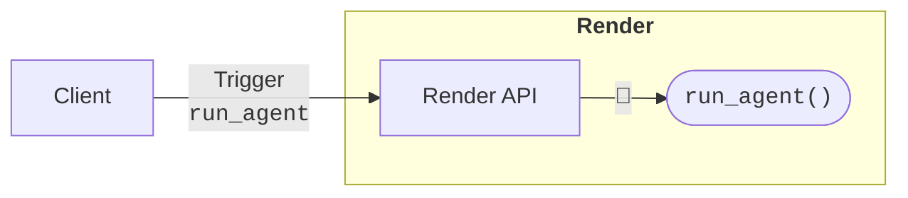

# Intro to Render Workflows — Orchestrate chains of long-running, distributed tasks.

*Render Workflows* is an end-to-end orchestration and execution engine for long-running, distributed tasks.

Define tasks as standard functions with Render's lightweight SDK, then dispatch them across hundreds of concurrent instances.

Use workflows to orchestrate AI agents, background jobs, data pipelines, and more:

**Tab: AI Agent**

```timeline
run_agent() (start +0s, run 30s, end +30s) [root]
├── gather_context() (start +1s, run 9s, end +10s)
│   ├── search_web() (start +2s, run 8s, end +10s)
│   └── fetch_docs() (start +2s, run 7s, end +9s)
├── execute_skills() (start +11s, run 8s, end +19s)
└── compose_response() (start +20s, run 9s, end +29s)
```

**Tab: Background Job**

```timeline
onboard_employee() (start +0s, run 40s, end +40s) [root]
├── provision_user() (start +1s, run 19s, end +20s)
├── add_to_payroll() (start +22s, run 17s, end +39s)
├── create_accounts() (start +22s, run 15s, end +37s)
└── enroll_benefits() (start +22s, run 13s, end +35s)
```

**Tab: ETL Pipeline**

```timeline
run_etl_pipeline() (start +0s, run 120s, end +120s) [root]
├── extract_orders() (start +3s, run 60s, end +63s)
│   ├── enrich_orders() (start +20s, run 38s, end +58s)
│   └── clean_orders() (start +20s, run 36s, end +56s)
└── load_warehouse() (start +68s, run 50s, end +118s)
```

**Tab: Batch Processing**

```timeline
process_batch() (start +0s, run 120s, end +120s) [root]
├── process_item(…) (start +3s, run 82s, end +85s)
├── process_item(n) (start +3s, run 80s, end +83s)
├── process_item(1) (start +3s, run 78s, end +81s)
└── aggregate() (start +88s, run 30s, end +118s)
```

Your workflow service handles task queuing, scheduling, and compute for you, all managed together on Render infrastructure.

## At a glance

1. You [define your tasks](/workflows-defining) as standard TypeScript or Python functions and register them with Render.
2. [Trigger task runs](/workflows-running) from anywhere: web apps, agents, CI/CD, etc.
    - A task can chain runs of other tasks (or itself!) as illustrated above.
3. Render automatically spins up a separate instance for each task run and deprovisions instances as runs complete.
    - If a task run fails, Render automatically retries it according to your [settings](/workflows-defining#retry-logic).

Render bills you for compute usage (prorated by the second) and for temporary retention of your task arguments and return values. Render queues and provisions your task runs at no additional cost.

## Core features

- Tasks as functions: [Define tasks](/workflows-defining) with the Render SDK. Chain tasks by calling one task's function from another.
- Managed orchestration: Render handles task queuing, spin-up, and deprovisioning, all at no additional cost.
- Long-running execution: Each task run can execute for up to 24 hours. You can customize this [per task](/workflows-defining#timeout).
- Automatic retries: If a task run fails, Render automatically retries it according to your [settings](/workflows-defining#retry-logic).
- Per-task compute specs: Use larger [instance types](/workflows-defining#instance-type-compute-specs) for your most resource-intensive workloads.
- Rich observability: Track the status of active and completed runs in the Render Dashboard.
- CLI integration: Create new workflow services, trigger runs, and view run history from the command line.
- Rapid local development: Quickly iterate on your task logic by spinning up a [local task server](/workflows-local-development).

## What's in a workflow?

A workflow service is a collection of tasks that you define as code and register with Render:

[image: A list of registered tasks in the Render Dashboard]

### Execution flow

After you create your workflow service, you can trigger individual runs of its tasks using the Render SDK or API:



Each run executes in its own instance, which Render spins up on demand within seconds. If you trigger more simultaneous runs than your workflow's [provisioning limit](/workflows-limits#provisioning-limits) allows, Render queues up the excess until resources become available.

A task executes whatever logic you define in its function. This can include chaining runs of other tasks in the same workflow:

```timeline
run_agent() (start +0s, run 30s, end +30s) [root]
├── gather_context() (start +1s, run 9s, end +10s)
│   ├── search_web() (start +2s, run 8s, end +10s)
│   └── fetch_docs() (start +2s, run 7s, end +9s)
├── execute_skills() (start +11s, run 8s, end +19s)
└── compose_response() (start +20s, run 9s, end +29s)
```

In this example, we trigger a run of the `run_agent` task. This task chains runs of other tasks (`gather_context`, `execute_skills`, and so on). Each run in the chain _also_ executes in its own instance.

The `run_agent` task depends on the results of its various chained runs, so it awaits their completion before chaining additional runs and eventually returning its own result.

### Defining tasks

Every workflow service pulls its task definitions from a GitHub/GitLab/Bitbucket repo. In this repo, you define tasks as TypeScript or Python functions using the Render SDK.

Here's a single-file workflow definition that defines two basic tasks:

**Tab: TypeScript**

```typescript
import { task, type TaskContext } from '@renderinc/sdk/workflows'

// Basic task that takes one argument
const calculateSquare = task(
  { name: 'calculateSquare' },
  function calculateSquare(ctx: TaskContext, a: number): number {
    return a * a
  }
)

// Task that chains two parallel runs of calculateSquare
const sumSquares = task(
  { name: 'sumSquares' },
  async function sumSquares(ctx: TaskContext, a: number, b: number): Promise<number> {
  
    // Parallelize with Promise.all
    const [result1, result2] = await Promise.all([
      ctx.run(calculateSquare, a),
      ctx.run(calculateSquare, b)
    ])

    // Return the sum of the two results
    return result1 + result2
  }
)
```

**Tab: Python**

```python
from render import TaskContext, Workflows
import asyncio

app = Workflows()

# Basic task that takes one argument
@app.task
def calculate_square(ctx: TaskContext, a: int) -> int:
  return a * a

# Task that chains two parallel runs of calculate_square
@app.task
async def sum_squares(ctx: TaskContext, a: int, b: int) -> int:

  # Parallelize with asyncio.gather
  result1, result2 = await asyncio.gather(
    ctx.run(calculate_square, a),
    ctx.run(calculate_square, b)
  )

  # Return the sum of the two results
  return result1 + result2
```

You can define workflow tasks across any number of files and directories, importing frameworks and libraries as needed.

As part of registering your workflow's tasks, Render builds your project into a custom image and caches it. Render pushes this image to each task run's instance as part of spin-up.

### Triggering runs

You trigger task runs from anywhere using the Render SDK or API:

**Tab: TypeScript**

```typescript
import { Render } from '@renderinc/sdk'

const render = new Render()

// Trigger a run of calculateSquare with the argument `2`
const startedRun = await render.workflows.startTask(
  'my-workflow/calculateSquare',
  [2],
)
const finishedRun = await startedRun.get()
console.log(finishedRun.results)
```

**Tab: Python (async)**

```python
from render import RenderAsync

render = RenderAsync()

# Trigger a run of calculate_square with the argument `2`
started_run = await render.workflows.start_task(
  "my-workflow/calculate_square",
  [2],
)
finished_run = await started_run
print(finished_run.results)
```

**Tab: Python (sync)**

```python
from render import Render

render = Render()

# Trigger a run of calculate_square with the argument `2`
finished_run = render.workflows.run_task(
  "my-workflow/calculate_square",
  [2],
)
print(finished_run.results)
```

**Tab: REST API**

In any environment where the Render SDK isn't available, you can trigger task runs directly via the [Render API](api). Here's an example `curl` command:

```bash
# Trigger a run of calculate_square with the argument `2`
curl -X POST https://api.render.com/v1/task-runs \
  -H "Authorization: Bearer rnd_abc123..." \
  -H "Content-Type: application/json" \
  -d '{"task": "my-workflow/calculate_square", "input": [2]}'
```

All versions of the Render SDK call the Render API under the hood to trigger task runs.

For all the details, see [Triggering Task Runs](/workflows-running).

## Workflows versus job queues

Historically, job queue architectures (as managed by Celery, BullMQ, etc.) have required setting up multiple pieces of infrastructure and configuring them to work together:

[image: Diagram of a background worker polling a task queue]

Render Workflows unifies this architecture into a single, fully managed system:

| Role | Traditional job queue | Render Workflows |
| --- | --- | --- |
| *Task submission* | You deploy a custom web service that listens for incoming requests and enqueues workloads. | Trigger task runs from anywhere using the Render SDK or API. |
| *Queue management* | You manage your own queue state in a Render Key Value instance or similar datastore. | Render manages your task queue at no additional cost. |
| *Worker provisioning* | You maintain a fleet of always-running background workers that pull and execute tasks. | Render provisions workers on demand and scales to zero when all runs finish. |

For new projects that require long-running background execution, Render Workflows helps you move faster with fewer moving parts.

## FAQ

###### How do I get started with Render Workflows?

Get started with [Your First Workflow](/workflows-tutorial).

###### Which languages can I use to define workflow tasks?

You [define tasks](/workflows-defining) with the Render SDK, which is currently available for [TypeScript](/workflows-sdk-typescript) and [Python](/workflows-sdk-python).

SDKs for additional languages are planned for future releases.

###### Can I trigger task runs without using the Render SDK?

Yes! You can trigger task runs via the Render SDK, API, CLI, or Dashboard.

For details, see [Triggering Task Runs](/workflows-running).

###### Can task runs interact with my other Render services?

Yes! Task runs can initiate connections to your other Render services and datastores in the same region via private networking.

###### Can my task runs receive incoming network connections?

No. Similar to Render's background worker service type, task runs do not expose any ports. They initiate any network connections they need.

###### How are workflows billed?

Workflows are billed for the compute usage of each task run, based on instance type and duration. They are also billed for temporary retention of each task run's arguments and return value.

For details, see [Limits and Pricing for Render Workflows](/workflows-limits).

###### What are the known limitations of Render Workflows?

We'll address these limitations in future releases:

- Workflows currently only support TypeScript and Python for defining tasks.
  - SDKs for other languages are planned for future releases.
- Workflows do not yet natively support scheduling task runs.
  - To schedule runs, you can create a [cron job](cronjobs) that runs your tasks on the desired schedule.
- Blueprints do not yet support creating or managing workflows.
- If a workflow belongs to a [network-isolated environment](projects#blocking-cross-environment-traffic), its runs _cannot_ communicate with other services in that environment over its private network.
- Workflows do not yet support running tasks on [HIPAA-compliant](hipaa-compliance) hosts.
  - To prevent accidental PHI exposure, it is not currently possible to create new workflows in a HIPAA-enabled workspace.
  - If you enable HIPAA compliance for a workspace that already has workflows, *do not process PHI in workflow tasks.*


---

##### Appendix: Glossary definitions

###### instance

A containerized environment that runs your service's code on Render.

You can select from a range of *instance types* with different compute specs.

###### run chaining

Triggering a new *task run* directly from an in-progress run.

All runs in a chain belong to the same *workflow*.

Related article: https://render.com/docs/workflows-defining.md#chaining-task-runs

###### task

A function you can execute on its own compute as part of a *workflow*.

Each execution of a task is called a *run*.

Related article: https://render.com/docs/workflows-defining.md

###### task run

A single execution of a workflow *task*.

A run spins up in its own *instance*, executes, returns a value, and is deprovisioned.

Related article: https://render.com/docs/workflows-running.md

###### web service

Deploy this *service type* to host a dynamic application at a public URL.

Ideal for full-stack web apps and API servers.

Related article: https://render.com/docs/web-services.md

###### Render Key Value

Fully managed, Redis®-compatible storage ideal for use as a job queue or shared cache.

Related article: https://render.com/docs/key-value.md

###### background worker

Deploy this *service type* to continuously run code that does not receive incoming requests.

Ideal for processing jobs from a queue.

Related article: https://render.com/docs/background-workers.md

###### private network

Your Render services in the same *region* can reach each other without traversing the public internet, enabling faster and safer communication.

Related article: https://render.com/docs/private-network.md

###### Render Blueprints

Render's infrastructure-as-code model.

Configure multiple related services and datastores in a single YAML file. Render automatically syncs any changes you push.

Related article: https://render.com/docs/infrastructure-as-code.md