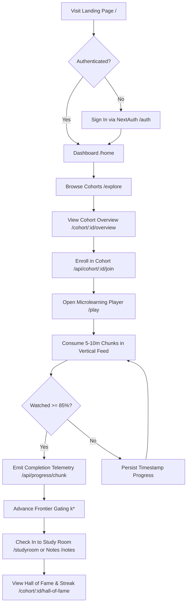
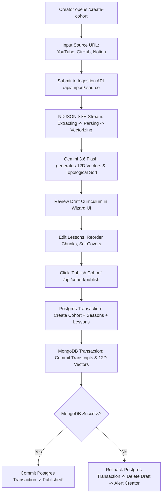
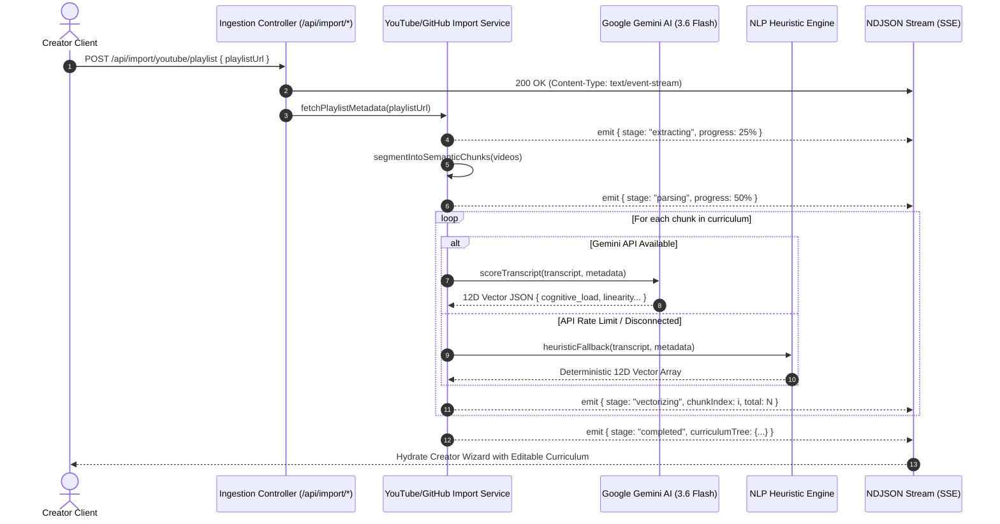
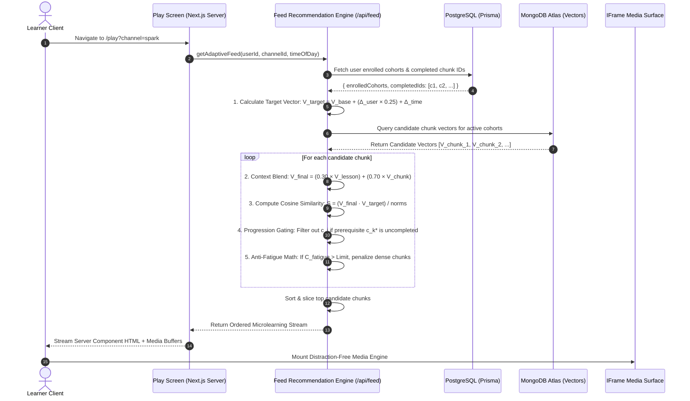
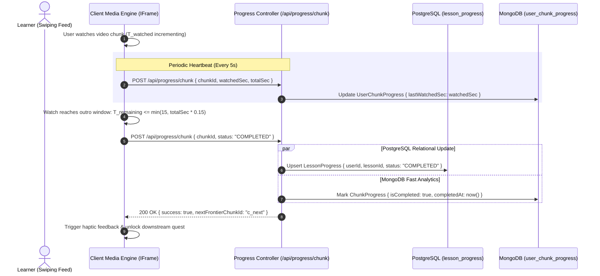
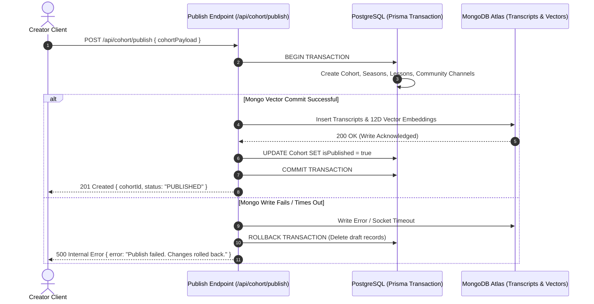
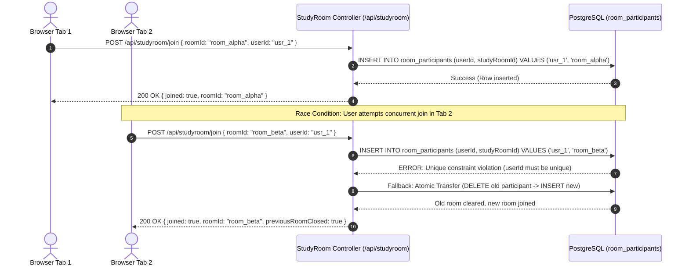
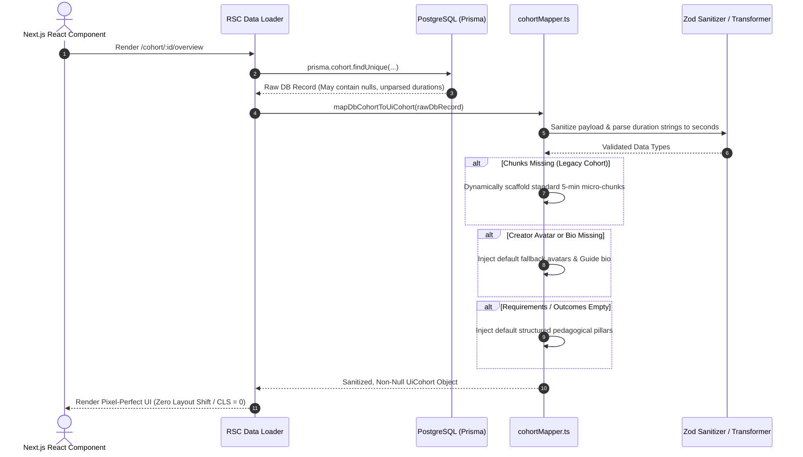

# SideQuestHQ — End-to-End Flow of Solution Document

> **Document Type:** System Solution Flow & Operational Architecture  
> **Platform:** SideQuestHQ  
> **Version:** 2.0.0 (Production Specification)  
> **Scope:** End-to-end user journeys, technical sequence diagrams, asynchronous streaming pipelines, state machines, and fail-safe recovery protocols.

---

## 1. Solution Architecture & Paradigm

SideQuestHQ solves the problem of educational friction and tutorial abandonment by deconstructing monolithic media (2–3 hour YouTube videos, long Notion docs, complex GitHub repos) into an interactive microlearning feed.

### The Macro Solution Flow

```
[Raw Long-Form Media]
  (YouTube / GitHub / Notion)
           │
           ▼
[AI Chunking & 12D Vector Scoring]
  (Gemini 3.6 Flash / NLP Heuristics)
           │
           ▼
[Dual-Database Atomic Publishing]
  (Postgres Relational Core + MongoDB Vectors)
           │
           ▼
[Adaptive Microlearning Feed Engine]
  (Target Vectors + Anti-Fatigue + Gating)
           │
           ▼
[Distraction-Free Playback & Telemetry]
  (IFrame Eradication + Outro-Aware Auto-Completion)
           │
           ▼
[Habit Compounding & Social Accountability]
  (Progress Tracking + Study Rooms + Hall of Fame)
```

---

## 2. Primary User Journeys & Operational Workflows

---

### Journey A: The Explorer (Learner) Lifecycle



#### Step-by-Step Breakdown:
1. **Entry & Discovery**:
   - User lands on `/` or enters directly into `/home`.
   - If unauthenticated, public routes (`/cohort/[id]/overview`, `/questline`) dynamically query PostgreSQL for Open Graph tags and SSR metadata, permitting unauthenticated previewing without disruptive login walls.
2. **Authentication & Session Issuance**:
   - Login via NextAuth v5 OAuth providers (Google, GitHub, Apple).
   - `@auth/prisma-adapter` creates a durable session row in the PostgreSQL `sessions` table.
3. **Cohort Discovery & Enrollment**:
   - Learner selects a Cohort from `/explore`.
   - On clicking "Join Cohort", `POST /api/cohort/[id]/join` idempotently upserts a `CohortMember` record with compound key `@@id([cohortId, userId])`.
4. **Active Microlearning Session (`/play`)**:
   - Feed engine queries candidate chunks, calculates the user's current Target Vector $V_{\text{target}}$, checks the anti-fatigue score, and streams buffered video atoms.
   - User swipes vertically through 5–10 minute chunks with distraction-free playback (YouTube overlays and recommendations stripped).
5. **Progress Telemetry & Frontier Advancement**:
   - Watch progress sends heartbeat pings to `/api/progress/chunk`.
   - Once watch time crosses the outro threshold ($T_{\text{remaining}} \leq \min(15, T_{\text{total}} \times 0.15)$), the chunk transitions to `COMPLETED`, advancing the user's sequential prerequisite frontier $k^*$.
6. **Collaboration & Reflection**:
   - Learner can drop into a live voice Study Room (`/studyroom`) or jot quick markdown notes and canvas sketches (`/notes`, `/api/workspace/canvas`).

---

### Journey B: The Creator (Curator) Ingestion Lifecycle



#### Step-by-Step Breakdown:
1. **Source Ingestion**:
   - Creator pastes a YouTube Playlist URL, GitHub repository link, or Notion workspace token into the creation wizard at `/create-cohort`.
2. **Streaming Extraction Pipeline**:
   - Server-Sent Events (NDJSON) stream progress back to the UI in real time (`stage: "extracting"` $\rightarrow$ `"parsing"` $\rightarrow$ `"vectorizing"`).
   - Corsair plugins traverse directory structures, fetch captions, calculate word counts, and segment content into atomic chunks.
3. **AI Evaluation & Linear Prerequisite Graphing**:
   - `VectorScoringService` sends chunk transcripts to Google Gemini (`gemini-3.6-flash`), scoring all 12 pedagogical dimensions and classifying linearity dependencies (`is_strictly_linear`).
4. **Draft Inspection & Editing**:
   - Creator inspects generated Seasons, Lessons, and Chunks in an interactive tree view.
   - Adjusts durations, titles, requirements, and tags before committing.
5. **Dual-Database Atomic Publishing**:
   - Submits draft to `/api/cohort/publish`.
   - System orchestrates dual writes across PostgreSQL and MongoDB with rollback protection.

---

## 3. Deep-Dive Technical Sequence Flows

---

### Flow 1: Content Ingestion & AI Vectorization Pipeline

This flow details how raw YouTube playlists or GitHub repos become a structured, vector-scored curriculum.



---

### Flow 2: Adaptive Feed Generation & Playback Runtime (`/play`)

This flow describes the mathematical scoring and anti-fatigue interleaving executed every time a learner requests content in the `/play` feed.



---

### Flow 3: Media Progress Telemetry & Outro-Aware Auto-Completion

This flow illustrates continuous timestamp persistence and smart auto-completion during video playback.



---

### Flow 4: Dual-Database Atomic Publishing Protocol

This flow guarantees that cohorts are never published in a broken state where relational data exists in PostgreSQL but vector embeddings or transcripts are missing from MongoDB.



---

### Flow 5: Global Concurrency Enforcement in Study Rooms

This flow demonstrates how database constraints guarantee that a user cannot occupy multiple study rooms simultaneously across different tabs or devices.



---

### Flow 6: Defensive UI Mapping & Fallback Perimeter

This flow illustrates how `cohortMapper.ts` isolates client components from unexpected database variations or legacy data shapes.



---

## 4. State Machines & Data Transition Models

---

### 4.1 Lesson Progress State Machine

```
               ┌────────────────┐
               │  NOT_STARTED   │
               └───────┬────────┘
                       │ User starts video chunk in /play
                       ▼
               ┌────────────────┐
  Heartbeat    │  IN_PROGRESS   │ ◄─── (Timestamp persisted every 5s)
  ───────────> │ (0 < T < 85%)  │
               └───────┬────────┘
                       │ T_remaining <= min(15s, T_total * 0.15)
                       ▼
               ┌────────────────┐
               │   COMPLETED    │
               └───────┬────────┘
                       │
                       ▼
       [Unlocks Next Sequential Quest (k* + 1)]
```

---

### 4.2 Cohort Lifecycle State Machine

```
 ┌─────────┐   Ingest Source    ┌────────────┐   AI Vectorization   ┌──────────────┐
 │  INIT   │ ─────────────────> │ EXTRACTING │ ───────────────────> │  VECTORIZING │
 └─────────┘                    └────────────┘                      └──────┬───────┘
                                                                           │
 ┌──────────────┐      Creator Publishes      ┌───────────┐                │
 │  PUBLISHED   │ ◄────────────────────────── │   DRAFT   │ ◄──────────────┘
 └──────┬───────┘                             └─────┬─────┘
        │                                           │
        │ MongoDB Failure                           │ Incomplete Data
        ▼                                           ▼
 ┌──────────────┐                             ┌───────────┐
 │ ROLLED_BACK  │                             │ ARCHIVED  │
 └──────────────┘                             └───────────┘
```

---

## 5. Failure Modes, Edge Cases & Self-Healing Behaviors

| Subsystem / Scenario | Potential Failure | Self-Healing / Recovery Protocol |
| :--- | :--- | :--- |
| **Gemini AI Rate Limit** | `429 Too Many Requests` or missing API key during ingestion | System seamlessly falls back to `VectorScoringService.heuristicFallback()`, computing 12D vectors deterministically via regex token density and speech-rate WPM. |
| **MongoDB Network Timeout** | Serverless cold boot causes Mongo write to timeout during publish | `POST /api/cohort/publish` aborts the PostgreSQL transaction and deletes draft rows, returning HTTP 500 to prevent un-indexed orphan cohorts. |
| **User Drops at Video Outro** | User leaves video 10 seconds before completion during YouTube outro cards | The auto-completion window ($T_{\text{remaining}} \leq \min(15, T_{\text{total}} \times 0.15)$) detects outro entry and credits 100% completion automatically. |
| **Concurrent Study Room Join** | User clicks "Join Room" simultaneously across 2 browser tabs | PostgreSQL unique index `@unique([userId])` rejects the race condition with error code `P2002`; controller executes atomic transfer without data corruption. |
| **Legacy Cohort Chunk Absence** | Cohort generated prior to microlearning parser lacks `chunks` JSON | `cohortMapper.ts` detects null chunks and synthesizes 5-minute virtual chunk scaffolds, preventing client crashes or layout shifts. |
| **Offline Mobile Usage** | Device loses internet connectivity while browsing `/play` feed | `CapacitorBridge.tsx` captures network state, switches to offline fallback indicators, and queues progress telemetry in `localStorage` until reconnect. |

---

## 6. Technical Stack & File Directory Mapping

| Architectural Layer | Implementation Files & Core Modules |
| :--- | :--- |
| **Ingestion Controllers** | [`src/app/api/import/youtube/playlist/route.ts`](file:///d:/ThisPC/Documents/SideQuestHQ/sidequesthq-site/src/app/api/import/youtube/playlist/route.ts), [`src/app/api/import/github/route.ts`](file:///d:/ThisPC/Documents/SideQuestHQ/sidequesthq-site/src/app/api/import/github/route.ts), [`src/app/api/import/notion/route.ts`](file:///d:/ThisPC/Documents/SideQuestHQ/sidequesthq-site/src/app/api/import/notion/route.ts) |
| **AI & Vector Scoring** | [`src/server/domain/cohort/vectorScoring.service.ts`](file:///d:/ThisPC/Documents/SideQuestHQ/sidequesthq-site/src/server/domain/cohort/vectorScoring.service.ts), [`src/shared/curriculum/pedagogicalVector.engine.ts`](file:///d:/ThisPC/Documents/SideQuestHQ/sidequesthq-site/src/shared/curriculum/pedagogicalVector.engine.ts) |
| **Relational Database** | [`prisma/schema.prisma`](file:///d:/ThisPC/Documents/SideQuestHQ/sidequesthq-site/prisma/schema.prisma) (PostgreSQL models: `User`, `Cohort`, `Season`, `Lesson`, `RoomParticipant`) |
| **Vector & Transcript DB** | [`src/server/database/mongo/models/Chunk.ts`](file:///d:/ThisPC/Documents/SideQuestHQ/sidequesthq-site/src/server/database/mongo/models/Chunk.ts), [`src/server/database/mongo/models/CohortTranscript.ts`](file:///d:/ThisPC/Documents/SideQuestHQ/sidequesthq-site/src/server/database/mongo/models/CohortTranscript.ts) |
| **Feed Recommender** | [`src/app/api/feed/route.ts`](file:///d:/ThisPC/Documents/SideQuestHQ/sidequesthq-site/src/app/api/feed/route.ts), [`docs/feed-architecture.md`](file:///d:/ThisPC/Documents/SideQuestHQ/sidequesthq-site/docs/feed-architecture.md) |
| **Defensive Mapper** | [`src/server/infrastructure/db/postgres/mappers/cohortMapper.ts`](file:///d:/ThisPC/Documents/SideQuestHQ/sidequesthq-site/src/server/infrastructure/db/postgres/mappers/cohortMapper.ts) |
| **Security & Sessions** | [`src/server/infrastructure/auth/auth.config.ts`](file:///d:/ThisPC/Documents/SideQuestHQ/sidequesthq-site/src/server/infrastructure/auth/auth.config.ts), [`src/server/infrastructure/auth/requireUser.ts`](file:///d:/ThisPC/Documents/SideQuestHQ/sidequesthq-site/src/server/infrastructure/auth/requireUser.ts) |
| **Client Screens** | [`src/app/(dashboard)/play/page.tsx`](file:///d:/ThisPC/Documents/SideQuestHQ/sidequesthq-site/src/app/(dashboard)/play/page.tsx), [`src/app/(dashboard)/create-cohort/page.tsx`](file:///d:/ThisPC/Documents/SideQuestHQ/sidequesthq-site/src/app/(dashboard)/create-cohort/page.tsx) |
| **Native Mobile Bridge** | [`src/client/components/global/CapacitorBridge/CapacitorBridge.tsx`](file:///d:/ThisPC/Documents/SideQuestHQ/sidequesthq-site/src/client/components/global/CapacitorBridge/CapacitorBridge.tsx) |
